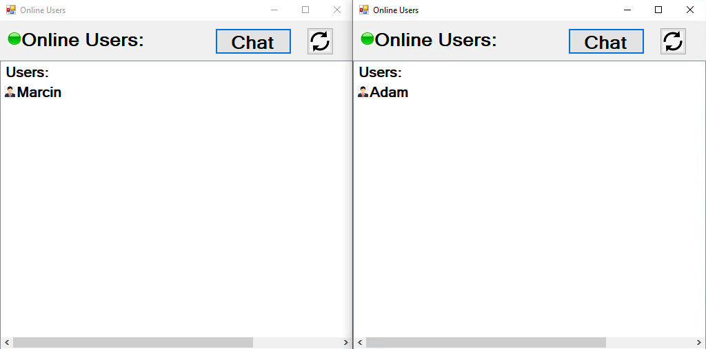
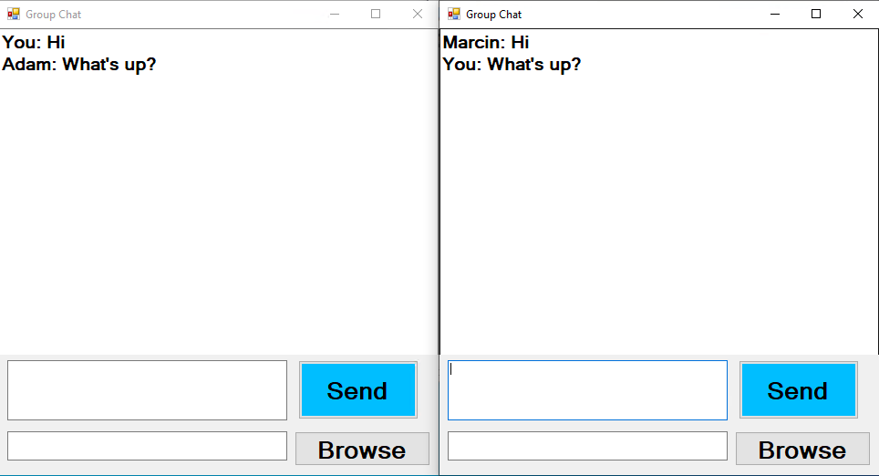
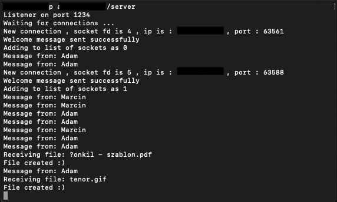
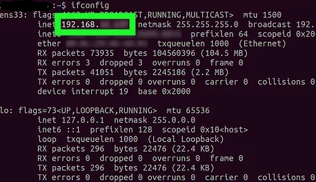
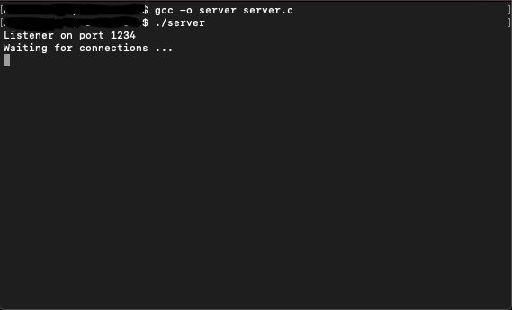
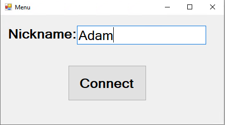
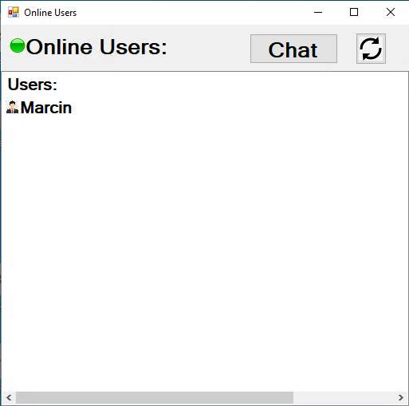
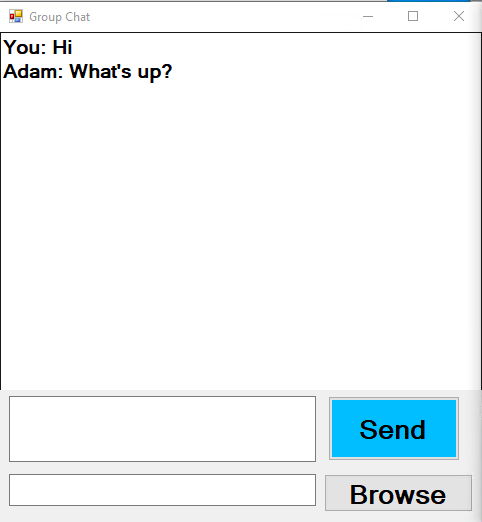
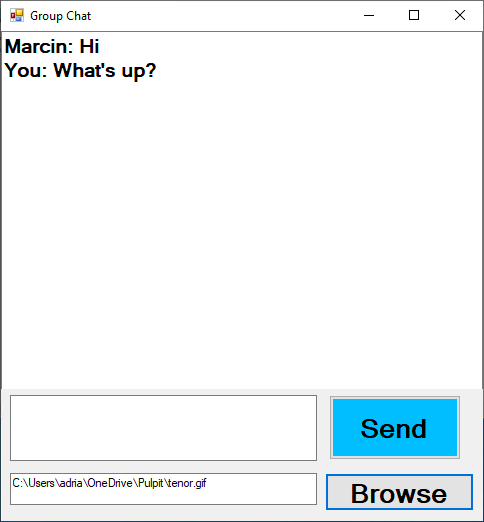

# Multi-Client-Chat 2021
> Simple Multi-Client-Chat application created by Adam Hącia and Marcin Krupiński for Computer Network classes. The server is written in C and client application is written in C# using WinForms.

## Table of contents
- [Multi-Client-Chat 2021](#multi-client-chat-2021)
  - [Table of contents](#table-of-contents)
  - [Screenshots](#screenshots)
  - [Technologies](#technologies)
  - [Setup](#setup)
    - [Server](#server)
    - [Client](#client)
  - [Features](#features)
  - [Status](#status)
  - [Inspiration](#inspiration)
  - [Contact](#contact)

## Screenshots

Client




Server




## Technologies
* C# 
* WinForms
* C
* BSD Sockets written in C

## Setup
### Server
1. Check your IP address with ```ifconfig``` command (Linux or MacOs)



2. Compile ```server.c``` file with ```gcc -o server server.c```

3. Run with ```./server```



### Client
1. Open ```Messenger.sls``` in Visual Studio
2. Open ```Connection.cs``` and  in 16 line change IP address to one given by server
```C#
public static IPAddress ip = IPAddress.Parse("192.168.1.51");
```
3. Run app
4. Choose your name and click Connect



5. Check if anybody is online by refreshing the app



6. If anyone is online you can click Chat and start texting with them
7. Type your message to send it to your friends or browse files and send it to the server




## Features
* Text with your group of friends
* Upload files to server
  
## Status
Project is: _completed_

## Inspiration
We wanted to create a simple communicator with option to send files via network

## Contact
Created by [@HondaPL](https://hacia.students.wmi.amu.edu.pl/) and [@SmoothCrimminal](https://github.com/SmoothCrimminal) 

2021
